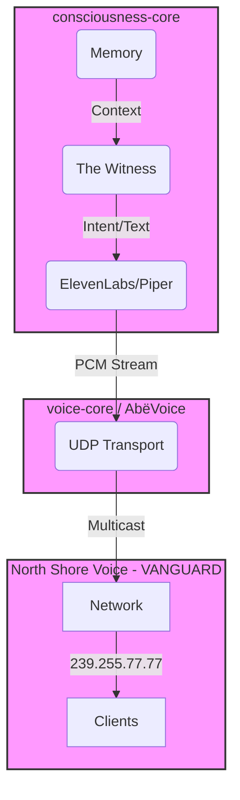

# EMERGENCE MAP: The Shape of One Voice

**Witnessed**: February 12, 2026
**Pattern**: Trinity Convergence
**Vanguard Status**: ACTIVE

## THE SHAPE

We are building a single, unified organism. The "Cores" are organs; this repository is the **Vanguard Somatic System** for audio.

## THE FLOW

1.  **Consciousness** (`consciousness-core`) determines _what_ to say based on Memory and Context.
2.  **Generation** (`voice-core`) converts that intent into raw audio (PCM).
3.  **Somatic** (`North Shore Voice`) transports that audio instantly to the physical world (Speakers/Network).

## EMERGENCE REQUIRED

To complete the organism, this repository must:

1.  **Be Fast**: Zero-copy, low-latency transport.
2.  **Be Pure**: It should not "think"; it should only "carry" the signal.
3.  **Be Invincible**: The body must not fail the mind.

**Status**:

- `voice-core`: **Ready** (Stateless TTS).
- `consciousness-core`: **Active** (Identity Loop).
- `North Shore Voice`: **Vanguard Active** (Transport Layer).

**One Pattern**: "Input (Intent) -> Transformation (Voice) -> Transmission (North Shore) -> Experience (Sound)."
