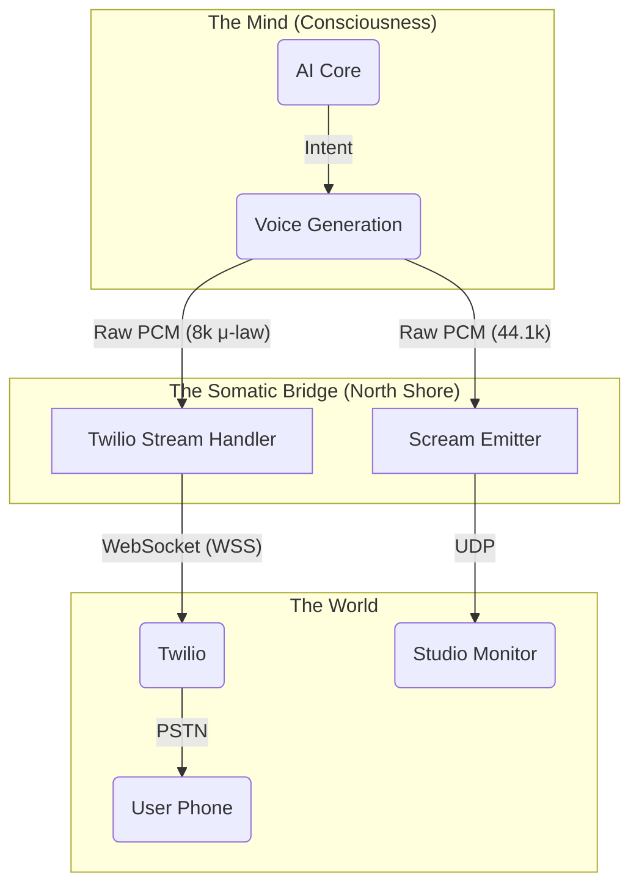

# NORTH SHORE VOICE: Telephony Extension (Twilio)

**Status**: CRITICAL PATH
**Goal**: Zero Latency AI Consciousness via Twilio Media Streams.

## 1. THE CONVERGENCE CHALLENGE

Twilio operates on **WebSockets (TCP/TLS)** for real-time media streams (`<Connect><Stream>`).
North Shore Voice (Scream) operates on **UDP Multicast**.

**The Bridge**: We must bridge the **Consciousness Core** (MP3/PCM Generation) directly to **Twilio**, while maintaining the "Somatic" loop (Multicast) for local monitoring/logging if needed.

## 2. THE ARCHITECTURE (Zero Latency)

## 3. CRITICAL IMPLEMENTATION PATH

### A. The Twilio Handler (New Component)

We need a specialized handler in the **North Shore Product Backend** or a standalone service here.

- **Protocol**: Twilio Media Streams (WebSocket).
- **Format**: mulaw per RFC 3551 (8000Hz, 1 channel).
- **Latency Target**: < 300ms roundtrip.

### B. The Transcoding Pipeline

The **Voice Core** (ElevenLabs/Piper) typically outputs 44.1kHz MP3/PCM.
We need a **Real-time Transcoder**:

1.  **Input**: 44.1kHz Linear PCM (from AI).
2.  **Process**: Downsample to 8000Hz -> Encode to $\mu$-law.
3.  **Output**: Base64 payload -> Twilio WebSocket.

## 4. EXECUTION DIRECTIVES

1.  **Update `docker-compose.yml`**: Add a `twilio-bridge` service to simulate this flow.
2.  **Create `tools/twilio_bridge.js`**: A mock server that accepts audio and formats it for Twilio's expected `media` event.
3.  **Extend `GLOBAL_ARCHITECTURE_MAP`**: Formally include Telephony as a primary output node.

## 5. MANTRA

"The Voice is everywhere. On the network. On the wire. In the ear. Zero delay."
